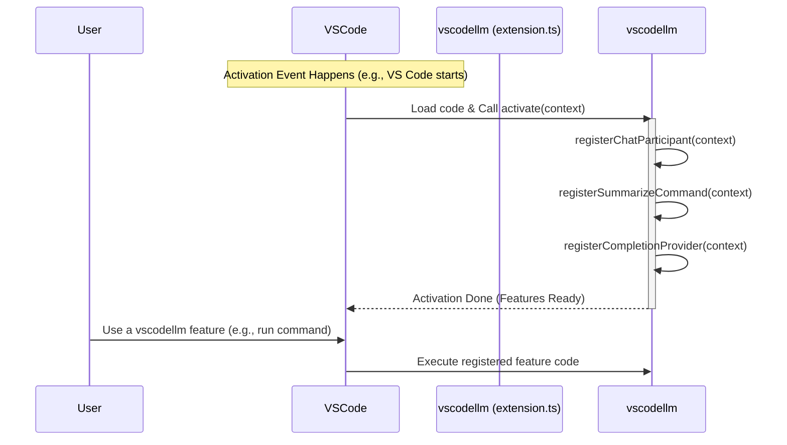

# Chapter 1: Extension Lifecycle & Registration

Welcome to the `vscodellm` tutorial! We're excited to have you explore how this extension brings Large Language Models (LLMs) right into your Visual Studio Code editor.

In this first chapter, we'll look at the very beginning: how does our extension even start running inside VS Code? Think of it like turning the key in a car – there's a specific process to get the engine running before you can drive.

## What's the Big Idea? The Extension's "Wake Up" Call

Imagine you've built some cool features, like asking an AI assistant questions or getting code suggestions. How does VS Code know about these features? And when should it make them available?

That's where the **Extension Lifecycle & Registration** comes in. It's the fundamental process where VS Code:

1.  **Activates** (wakes up) our extension when needed.
2.  Runs a special "setup" function in our code.
3.  This setup function then **registers** (tells VS Code about) all the different features the extension offers, like commands, chat abilities, or code completion helpers.

Think of the main file, `src/extension.ts`, as the conductor of an orchestra. When the concert (VS Code session) starts and it's the orchestra's turn (extension activation), the conductor (`activate` function) signals each section (commands, chat, etc.) to get ready (registration).

## Key Concepts: Activation and Registration

Let's break down the key parts:

1.  **Activation Event:** VS Code doesn't run all extensions all the time (that would be slow!). It waits for a specific *event*. This could be:
    *   A user running a specific command defined by the extension.
    *   Opening a file of a certain language (like Python or Java).
    *   VS Code starting up (if the extension needs to run always).
    *   *(For `vscodellm`, it activates soon after VS Code starts, making its features readily available).*

2.  **Entry Point (`src/extension.ts`):** When an activation event happens, VS Code looks for a specific file in our extension's code. By convention, this is usually `src/extension.ts`. This is the front door to our extension's code.

3.  **The `activate` function:** Inside `extension.ts`, VS Code looks for and calls a special function named `activate`. This function is the *main starting point* for our extension's setup logic. It receives a special `context` object from VS Code, which provides helpful information and utilities.

4.  **Registration:** Inside the `activate` function, we tell VS Code about each feature we want to add. This is called "registration". We essentially say, "Hey VS Code, here's a new command called 'Summarize Codebase', and here's the code to run when someone uses it." We do this for *all* features: chat participants, code completion, commands, etc.

5.  **The `deactivate` function:** There's also a `deactivate` function in `extension.ts`. VS Code calls this if the extension is shut down. It's used for any cleanup tasks, like closing files or disconnecting from databases.

## Walking Through the Code (`src/extension.ts`)

Let's look at the actual starting point of the `vscodellm` extension.

```typescript
// src/extension.ts

// Import the VS Code API - gives us access to VS Code features
import * as vscode from 'vscode';

// Import functions from other files that handle specific features
import { registerApplySuggestedChangesCommand } from './commands/applySuggestedChanges';
import { registerSummarizeCodebaseCommand } from './commands/summarizeCodebase';
import { registerInlineCompletionProvider } from './providers/inlineCompletionProvider';
import {
	registerChatParticipant,
	registerSqlChatParticipant,
	registerRPGLEChatParticipant,
} from './participants/chatParticipant';
import { registerRunQueryCommand } from './commands/runQuery';

// This is the MAIN function called when the extension starts
export function activate(context: vscode.ExtensionContext) {

	// A message printed to the developer console (useful for debugging!)
	console.log('Congratulations, your extension "vscodellm" is now active!');

	// --- Feature Registration ---
	// Each 'register...' function tells VS Code about a feature.

	// Register chat assistants (RPGLE, SQL, general)
	registerRPGLEChatParticipant(context);
	registerSqlChatParticipant(context);
	registerChatParticipant(context); // General chat

	// Register commands users can run
	registerRunQueryCommand(context);       // For running SQL queries
	registerSummarizeCodebaseCommand(context); // For summarizing code
	registerApplySuggestedChangesCommand(context); // For applying AI changes

	// Register the inline code completion provider
	registerInlineCompletionProvider(context);
}

// This function is called when the extension is deactivated
export function deactivate() {
    // Usually used for cleanup, empty for now
}
```

**Explanation:**

1.  **Imports:** The lines starting with `import` bring in necessary pieces:
    *   `import * as vscode from 'vscode';` is crucial. It imports the entire VS Code API, allowing our extension to interact with the editor (like creating commands, showing messages, etc.).
    *   The other `import` lines bring in functions from *other files* within our project. Each of these functions is responsible for setting up a *specific* feature (like the `summarizeCodebase` command). This keeps our main `extension.ts` file clean and organized!
2.  **`activate(context)`:** This is the heart of the file. VS Code calls this function automatically when it's time to start our extension.
    *   `console.log(...)`: This is a simple message that gets printed to VS Code's developer console. It's a good way to confirm that our extension has indeed started.
    *   `register...` Calls: Each line like `registerSqlChatParticipant(context);` is a call to one of the functions we imported earlier. These functions contain the specific logic to tell VS Code about a feature. For example, `registerSummarizeCodebaseCommand(context)` tells VS Code:
        *   "There's a command called `vscodellm.summarizeCodebase`."
        *   "When a user runs this command, execute *this specific piece of code* (which is defined inside the `registerSummarizeCodebaseCommand` function)."
    *   `context`: Notice that `context` is passed into almost all the `register...` functions. This `context` object often provides ways to manage the resources created by the registration, ensuring they are cleaned up properly when the extension is deactivated.
3.  **`deactivate()`:** This function is currently empty. If our extension needed to do any cleanup (like closing network connections or deleting temporary files) when VS Code closes or the extension is disabled, we would put that code here.

## How it Fits Together (Analogy Revisited)

Think back to the orchestra:

*   **VS Code:** The concert hall and the audience.
*   **Activation Event:** The signal that it's time for the `vscodellm` orchestra to play.
*   **`src/extension.ts`:** The sheet music for the main conductor.
*   **`activate` function:** The conductor stepping onto the podium.
*   **`register...` functions:** The conductor pointing to each section (violins, trumpets, chat, commands, completion) and telling them, "Get ready to play when called upon!"
*   **`context`:** The conductor's baton and notes, helping manage the performance.

Here's a simplified flow:



## Conclusion: The Starting Line

You've now seen the very first step in how the `vscodellm` extension comes to life within VS Code! The `src/extension.ts` file, specifically its `activate` function, acts as the central hub. It doesn't do all the work itself, but it calls other specialized functions (`register...`) to prepare and announce all the extension's features to VS Code. Without this activation and registration process, none of the cool AI-powered tools would be available.

Now that we understand how the extension wakes up and registers its features, we can start diving into what those features actually *do*.

Next up, let's explore one of the core features: providing intelligent code suggestions as you type!

**Next Chapter:** [Chapter 2: Inline Code Completion Provider](02_inline_code_completion_provider.md)

---

Generated by [AI Codebase Knowledge Builder]