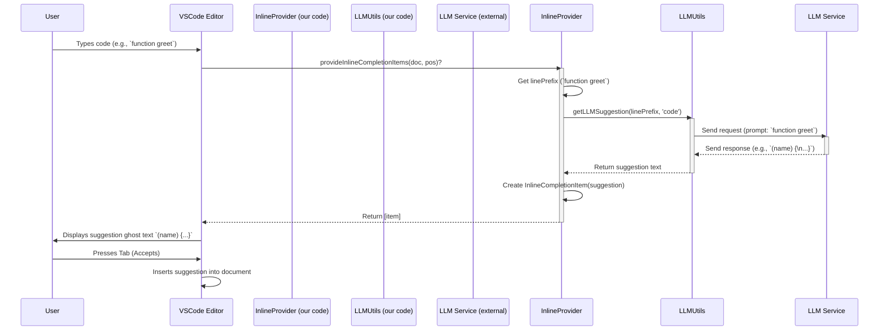

# Chapter 2: Inline Code Completion Provider

Welcome back! In [Chapter 1: Extension Lifecycle & Registration](01_extension_lifecycle___registration_.md), we saw how our `vscodellm` extension wakes up and tells VS Code about its features using the `activate` function in `src/extension.ts`.

Now, let's dive into one of those cool features: **Inline Code Completion**.

## What's the Big Idea? Your AI Pair Programmer

Imagine you're coding, maybe writing a function in Python or JavaScript. Wouldn't it be great if someone could look over your shoulder and suggest the next few lines of code, especially for repetitive tasks or common patterns?

That's exactly what the **Inline Code Completion Provider** does! It acts like a helpful AI pair programmer built right into your editor. As you type, it watches what you're writing, thinks about what might come next based on the context, and shows a *ghostly* suggestion right where your cursor is. If you like the suggestion, you just hit `Tab`, and *poof* – the code appears!

**Goal:** To help you code faster and potentially discover new ways to write things, powered by the intelligence of a Large Language Model (LLM).

## How Does it Work? A Quick Peek Behind the Curtain

The process is quite clever:

1.  **You Type:** You're editing a supported file (like `.js` or `.py`).
2.  **VS Code Asks:** As you pause typing, VS Code notices and asks our provider, "Hey, got any suggestions for this spot?"
3.  **Provider Gathers Context:** Our provider looks at the code you've just typed on the current line (specifically, the text *before* your cursor).
4.  **Talk to the LLM:** It sends this piece of code (the context) to the LLM via our [LLM Communication](05_llm_communication_.md) module, asking, "Based on this, what code likely comes next?"
5.  **LLM Responds:** The LLM analyzes the context and sends back its best guess for the completion.
6.  **Provider Shows Suggestion:** Our provider takes the LLM's response and tells VS Code, "Display this text suggestion right here."
7.  **You See It:** The suggested code appears faintly (often greyed out) in your editor.
8.  **You Accept (or Ignore):** You can press `Tab` to accept the suggestion or just keep typing to ignore it.

## Key Concepts

*   **Provider Registration:** Just like commands in Chapter 1, we need to *register* this completion feature with VS Code so it knows when and how to ask for suggestions. We tell VS Code which languages (e.g., 'javascript', 'python') this provider works for.
*   **`provideInlineCompletionItems`:** This is the special function *inside* our provider that VS Code calls automatically whenever it thinks a suggestion might be useful. This function contains the core logic (steps 3-6 above).
*   **Document & Position:** VS Code tells our provider *exactly* which file (`document`) and *where* the cursor (`position`) is, so we know what context to grab.
*   **Line Prefix:** This is the technical term for the text on the current line *leading up to* the cursor. It's the crucial piece of context we send to the LLM.
*   **Inline Completion Item:** This is the special object we give back to VS Code, containing the suggested text (`insertText`) and where it should appear (`range`).

## Registering the Provider (Connecting to Chapter 1)

Remember `src/extension.ts` from Chapter 1? It registered all our features. Here's the line that registers our inline completion provider:

```typescript
// src/extension.ts (inside the activate function)
import { registerInlineCompletionProvider } from './providers/inlineCompletionProvider';
// ... other imports and registrations ...

export function activate(context: vscode.ExtensionContext) {
	// ... other registrations ...

	// Register the inline code completion provider
	registerInlineCompletionProvider(context); // <--- This line!
}
```

This call runs the `registerInlineCompletionProvider` function located in `src/providers/inlineCompletionProvider.ts`, which sets everything up with VS Code.

## Walking Through the Code (`src/providers/inlineCompletionProvider.ts`)

Let's look at the provider's code itself. We'll simplify it slightly to focus on the main ideas.

```typescript
// src/providers/inlineCompletionProvider.ts
import * as vscode from 'vscode';
// Import the function that talks to the LLM
import { getLLMSuggestion } from '../utils/llmUtils';

// This function sets up the provider
export function registerInlineCompletionProvider(context: vscode.ExtensionContext) {
	// Tell VS Code: "For JS and Python files, use *this* object to get suggestions"
	const provider = vscode.languages.registerInlineCompletionItemProvider(
		// File types we care about
		[{ language: 'javascript' }, { language: 'python' }],
		{
			// This function is called BY VS Code automatically as you type!
			async provideInlineCompletionItems(document, position) {
				// 1. Get the text on the current line before the cursor
				const linePrefix = document.lineAt(position).text.substring(0, position.character);

				// Don't bother if the prefix is empty
				if (linePrefix.trim().length === 0) {
					return []; // Return no suggestions
				}

				// 2. Ask the LLM for a suggestion based on the prefix
				// We specify 'code' to get a code-like response
				const suggestion = await getLLMSuggestion(linePrefix, 'code');

				// 3. If the LLM gave a suggestion...
				if (suggestion) {
					// 4. Create the completion item for VS Code
					const item = new vscode.InlineCompletionItem(suggestion);
                    // We could add a range here, but let's keep it simple:
                    // VS Code will insert 'suggestion' at the current 'position'.
					return [item]; // Return the suggestion
				}

				// 5. If no suggestion, return empty
				return [];
			},
		},
	);

	// Make sure this provider is cleaned up when the extension is deactivated
	context.subscriptions.push(provider);
}

```

**Explanation:**

1.  **`registerInlineCompletionProvider(context)`:** This is the setup function called from `extension.ts`.
2.  **`vscode.languages.registerInlineCompletionItemProvider(...)`:** This is the core VS Code API call. We give it:
    *   An array specifying *which* files it applies to (JavaScript and Python files).
    *   An object containing the crucial `provideInlineCompletionItems` method.
3.  **`async provideInlineCompletionItems(document, position)`:** The heart of the provider! VS Code calls this function with:
    *   `document`: Information about the file being edited.
    *   `position`: The exact location of the cursor (line number, character number).
4.  **`linePrefix = ...`:** We use the `document` and `position` to extract the text on the current line *before* the cursor. This is our context.
5.  **`if (linePrefix.trim()...)`:** A simple check to avoid asking the LLM if there's no real code typed yet on the line.
6.  **`suggestion = await getLLMSuggestion(linePrefix, 'code')`:** We call our helper function (from `llmUtils.ts`, covered more in [Chapter 5](05_llm_communication_.md)) to send the `linePrefix` to the LLM and wait (`await`) for a response. We tell it we expect `'code'`.
7.  **`if (suggestion)`:** We check if the LLM actually returned something useful.
8.  **`new vscode.InlineCompletionItem(suggestion)`:** We create the object VS Code understands, simply putting the raw `suggestion` text into it. VS Code handles displaying it as that faint "ghost text".
9.  **`return [item]`:** We return the suggestion wrapped in an array.
10. **`return []`:** If we didn't get a suggestion or decided not to provide one (e.g., empty prefix), we return an empty array.
11. **`context.subscriptions.push(provider)`:** This ensures that when the extension stops, VS Code cleans up this provider registration.

## A Quick Look at the Messenger (`src/utils/llmUtils.ts`)

The `inlineCompletionProvider.ts` doesn't talk to the LLM directly. It uses a helper function, `getLLMSuggestion`, from `llmUtils.ts`. We'll explore this file deeply in Chapter 5, but here's the basic idea:

```typescript
// src/utils/llmUtils.ts (Simplified concept)

// Function to get suggestions from the configured LLM
export async function getLLMSuggestion(
    prompt: string, // The text we send (e.g., our 'linePrefix')
    type: 'code' | 'summary' | 'sql' | 'rpgle' // What kind of suggestion we want
): Promise<string | undefined> { // It promises to return text, or nothing

    // ... magic happens here to format the request ...
    // ... sends the request over the internet to the LLM endpoint ...
    // ... waits for the LLM's response ...
    // ... extracts the text content from the response ...

    // Example:
    // const responseText = await fetchLLM(prompt, type);
    // return responseText;

    // (Actual implementation details in Chapter 5)
    console.log(`(Pretend) Sending to LLM for type '${type}': "${prompt}"`);
    // Simulate a response for demonstration
    if (type === 'code' && prompt.includes('function greet')) {
        return `(name) {\n  console.log(\`Hello, \${name}!\`);\n}`;
    }
    return undefined; // Placeholder
}
```

This function takes our `linePrefix` (as the `prompt`) and the desired `type` ('code'), handles the communication details, and returns the LLM's text response.

## Visualizing the Flow

Here's how the pieces interact when you're typing:



## Conclusion: Your Coding Co-pilot is Ready!

You've now seen how `vscodellm` provides intelligent code suggestions as you type! By implementing a specific VS Code interface (`InlineCompletionItemProvider`) and registering it in `extension.ts`, we enable VS Code to call our code (`provideInlineCompletionItems`) at the right moments. This function grabs the context (`linePrefix`), uses the `LLM Communication` module to get an AI-powered suggestion, and then displays it seamlessly in the editor.

This feature demonstrates a powerful way to integrate LLMs directly into the coding workflow, aiming to make development faster and smoother.

Next, we'll explore another core interaction model: how users can directly chat with the AI assistant within VS Code.

**Next Chapter:** [Chapter 3: Chat Interaction Participants](03_chat_interaction_participants_.md)

---

Generated by [AI Codebase Knowledge Builder]