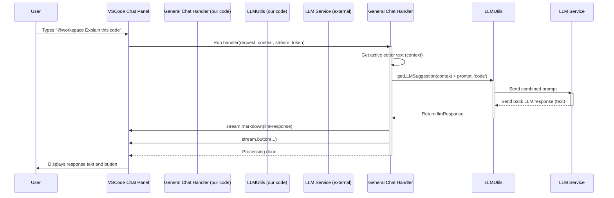

# Chapter 3: Chat Interaction Participants

Hey there! In [Chapter 2: Inline Code Completion Provider](02_inline_code_completion_provider_.md), we saw how `vscodellm` can suggest code right as you type, like a helpful co-pilot whispering in your ear.

Now, let's switch gears and look at another way to interact with the AI: the **Chat Panel**. Sometimes, you don't just want a quick code snippet; you want to have a conversation, ask a question, explain a problem, or get help with a specific task like writing a database query.

## What's the Big Idea? Having Different AI Experts on Call

Imagine walking into a big tech support center. You wouldn't ask the hardware specialist for help with your billing, right? You'd go to the right desk for your specific problem.

**Chat Interaction Participants** work similarly inside VS Code's Chat Panel (that little conversation icon, often in the Activity Bar). Instead of just *one* generic AI, `vscodellm` can set up *multiple*, specialized AI assistants.

*   Maybe you have a **general coding assistant** (`@workspace`) for everyday questions.
*   Perhaps you need an **SQL expert** (`@sql`) who knows about your database structure and can help write queries.
*   Or maybe a specialist for a specific language like **RPGLE** (`@rpgle`).

Each "participant" is like a different expert waiting in the chat. When you start your message with their name (e.g., `@sql what are the customer tables?`), VS Code directs your question to the correct expert. That expert then:

1.  Receives your message.
2.  Maybe looks at your open code or database information for context.
3.  Talks to the Large Language Model (LLM).
4.  Shows the answer back in the chat, sometimes with helpful buttons.

**Goal:** To provide targeted, context-aware AI assistance for various tasks directly within the familiar chat interface of VS Code.

## Key Concepts

1.  **Chat Panel:** The built-in VS Code feature that looks like a messaging app, where you can talk to AI assistants.
2.  **Chat Participant:** Our registered "expert" assistant. Each one has:
    *   A unique **name** (like `vscodellm.chat` or `vscode-sql-chat`) used internally. Users typically interact with them using `@` followed by a short name (like `@workspace` or `@sql`).
    *   A dedicated **handler function** that processes user messages sent specifically to it.
3.  **Handler Function (`vscode.ChatRequestHandler`)**: This is the core JavaScript/TypeScript function that gets triggered when a user sends a message to this participant. It's where the magic happens! It receives the user's `request` (their message) and a `stream` object to send the response back.
4.  **Context Gathering:** The handler might need extra information. For example, the general participant might look at your currently open code file, while the `@sql` participant might fetch your database schema using helper functions.
5.  **LLM Communication:** The handler packages the user's prompt and any gathered context, then sends it off to the LLM using our helper functions (covered in [Chapter 5: LLM Communication](05_llm_communication_.md)).
6.  **Streaming Response (`vscode.ChatResponseStream`)**: Instead of waiting for the entire AI answer, the handler uses the `stream` object to send back the response piece by piece (`stream.markdown(...)`). This makes the chat feel more responsive.
7.  **Interactive Buttons:** The handler can add buttons to the chat response (`stream.button(...)`). Clicking these buttons can trigger specific VS Code commands (which we'll cover in [Chapter 4: Command Handling](04_command_handling_.md)).

## Registering the Participants (Connecting to Chapter 1)

Just like our inline completion provider, these chat experts need to be introduced to VS Code. Back in `src/extension.ts`, the `activate` function calls registration functions for each participant:

```typescript
// src/extension.ts (inside the activate function)
import {
	registerChatParticipant, // General assistant
	registerSqlChatParticipant, // SQL expert
	registerRPGLEChatParticipant, // RPGLE expert
} from './participants/chatParticipant';
// ... other imports and registrations ...

export function activate(context: vscode.ExtensionContext) {
	// ... other registrations ...

	// Register chat assistants (RPGLE, SQL, general)
	registerRPGLEChatParticipant(context);     // <--- RPGLE expert setup
	registerSqlChatParticipant(context);      // <--- SQL expert setup
	registerChatParticipant(context);         // <--- General assistant setup

	// ... other registrations ...
}
```

Each `register...` function tells VS Code, "Hey, here's another AI assistant for the chat panel!"

## Walking Through the Code (`src/participants/chatParticipant.ts`)

Let's look at how the **general chat participant** (`vscodellm.chat`, often triggered by `@workspace`) is set up and how its handler works.

```typescript
// src/participants/chatParticipant.ts
import * as vscode from 'vscode';
import { getLLMSuggestion } from '../utils/llmUtils'; // To talk to the AI
// Import function to apply changes (more in Chapter 4)
// import { applySuggestedChanges } from '../commands/applySuggestedChanges';

// This function sets up the general chat participant
export function registerChatParticipant(context: vscode.ExtensionContext) {
	// Define the function that handles user messages
	const handler: vscode.ChatRequestHandler = async (
		request: vscode.ChatRequest, // What the user typed
		chatContext: vscode.ChatContext, // Extra info about the chat
		stream: vscode.ChatResponseStream, // How we send the response back
		token: vscode.CancellationToken, // To check if the user cancelled
	) => {
		// --- 1. Gather Context (Optional) ---
		const editor = vscode.window.activeTextEditor;
		let contextText = '';
		if (editor) {
			// Get all text from the currently open file
			contextText = editor.document.getText();
		}

		// --- 2. Prepare the Prompt for the LLM ---
		// Combine the file content with the user's actual question
		const combinedPrompt = `Context:\n${contextText}\n\nUser Query:\n${request.prompt}`;

		try {
			// --- 3. Talk to the LLM ---
			const llmResponse =
				(await getLLMSuggestion(combinedPrompt, 'code')) ?? 'Sorry, I could not get a response.';

			// --- 4. Stream the Response ---
			// Send the LLM's text answer back to the chat panel
			stream.markdown(llmResponse);

            // --- Store suggestion for later use by a command ---
            context.workspaceState.update('vscodellm.suggestedChanges', llmResponse);

			// --- 5. Add Interactive Elements (Optional) ---
			// Add a button that the user can click
			stream.button({
				// The command to run when clicked (see Chapter 4)
				command: 'vscodellm.applySuggestedChanges',
				title: 'Apply Suggested Changes', // Text on the button
			});

		} catch (error) {
            // Handle errors gracefully
			stream.markdown(`**Error:** Sorry, something went wrong.`);
			console.error(error);
		}
	};

	// --- Register the Participant with VS Code ---
	const participant = vscode.chat.createChatParticipant(
        'vscodellm.chat', // The internal name for this participant
        handler // The function to call when it gets a message
    );
	// Optional: Set a cool icon for the participant
	participant.iconPath = vscode.Uri.joinPath(context.extensionUri, 'resources', 'icon.png');
    // Make sure it gets cleaned up when the extension stops
    context.subscriptions.push(participant);
}

// Similar registration functions exist for SQL and RPGLE:
// export function registerSqlChatParticipant(context: vscode.ExtensionContext) { ... }
// export function registerRPGLEChatParticipant(context: vscode.ExtensionContext) { ... }
```

**Explanation:**

1.  **`registerChatParticipant(context)`:** The main setup function called from `extension.ts`.
2.  **`handler: vscode.ChatRequestHandler = async (...) => { ... }`:** This defines the asynchronous function (`async`) that will handle incoming chat messages. It receives:
    *   `request`: Contains the user's message (`request.prompt`).
    *   `chatContext`: More advanced info about the chat session (we don't use it much here).
    *   `stream`: The *very important* object used to send the response back to the chat panel.
    *   `token`: Allows checking if the user cancelled the request.
3.  **Gather Context:** It checks if there's an active text editor and grabs its entire content (`contextText`). This gives the AI background info.
4.  **Prepare Prompt:** It creates a `combinedPrompt` string, often prefixing the user's `request.prompt` with the gathered `contextText`. This helps the LLM understand the question *in the context* of the code.
5.  **Talk to LLM:** It calls `getLLMSuggestion` (from our `llmUtils`, see [Chapter 5](05_llm_communication_.md)) with the `combinedPrompt` and asks for a `'code'` type of response. It uses `await` because talking to the LLM takes time.
6.  **Stream Response:** `stream.markdown(llmResponse)` sends the AI's answer back to the chat panel. Using `.markdown()` allows for formatting like code blocks or bold text.
7.  **Store Suggestion:** `context.workspaceState.update(...)` saves the LLM's response. This is a temporary storage area that the "Apply Suggested Changes" command can access later (see [Chapter 4](04_command_handling_.md)).
8.  **Add Button:** `stream.button({...})` adds a clickable button below the response. We give it a `title` (what the user sees) and a `command` ID (`vscodellm.applySuggestedChanges`). When clicked, VS Code will try to run this command.
9.  **Error Handling:** The `try...catch` block ensures that if anything goes wrong (like the LLM failing), we send a helpful error message to the user instead of crashing.
10. **`vscode.chat.createChatParticipant(...)`:** This is the VS Code API call that officially registers our `handler` function under the internal name `vscodellm.chat`.
11. **Icon & Cleanup:** We assign an icon and ensure the participant is properly disposed of using `context.subscriptions.push()`.

## The Specialized Experts: SQL and RPGLE

The code also includes `registerSqlChatParticipant` and `registerRPGLEChatParticipant`. They follow the *exact same pattern* but differ slightly in their handlers:

*   **`registerSqlChatParticipant`:**
    *   Its handler might call a different function like `getDatabaseContext()` (see [Chapter 7](07_database_context_retrieval_.md)) to fetch database table information instead of the editor content.
    *   It passes this schema context along with the user prompt to the LLM, likely asking for an `'sql'` type response.
    *   It looks for SQL code blocks in the LLM response and might add a "Run Query" button, linking to a different command (`vscode-sql-chat.runQuery`).
*   **`registerRPGLEChatParticipant`:**
    *   Its handler might grab context from the editor (if it's an RPGLE file).
    *   It sends the prompt to the LLM asking for an `'rpgle'` type response.
    *   It might not need buttons, just displaying the explanation or code.

This shows the flexibility – each participant can tailor its context gathering, LLM interaction, and response handling for its specific job!

## Visualizing the Flow (General Participant)

Here's how a typical interaction with the general (`@workspace`) participant flows:



## Conclusion: Your Team of AI Specialists

Chat Interaction Participants are a powerful way to integrate different AI capabilities directly into VS Code's chat interface. By registering multiple participants, each with its own specialized handler function, `vscodellm` provides tailored assistance for various tasks – from general coding questions to database queries and language-specific help. They gather relevant context, interact with the LLM, and stream responses back, sometimes even adding interactive buttons for follow-up actions.

Speaking of those buttons, what happens when you click one? That leads us perfectly into our next topic: handling custom commands within VS Code.

**Next Chapter:** [Chapter 4: Command Handling](04_command_handling_.md)

---

Generated by [AI Codebase Knowledge Builder]