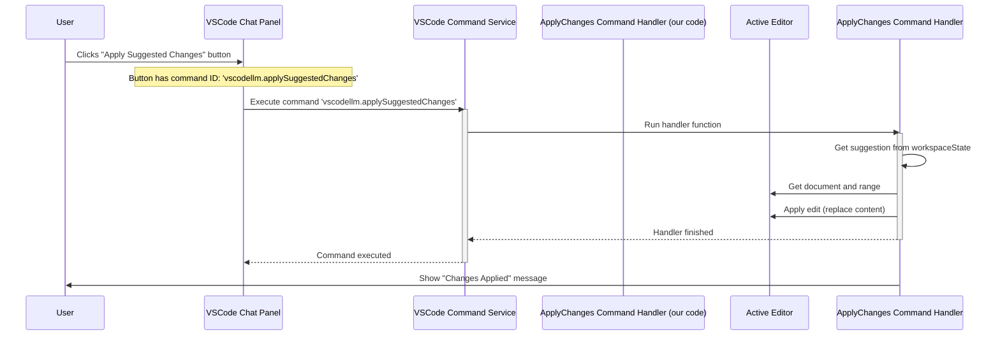

# Chapter 4: Command Handling

Welcome back! In [Chapter 3: Chat Interaction Participants](03_chat_interaction_participants_.md), we learned how our extension adds specialized AI assistants like `@sql` and `@workspace` to the VS Code Chat Panel. We even saw that these assistants can add buttons to their responses, like "Apply Suggested Changes" or "Run Query".

But what actually happens when you click one of those buttons? Or what if you want to trigger an extension action *without* chatting, maybe from the menu bar or the Command Palette (Ctrl+Shift+P / Cmd+Shift+P)?

That's where **Command Handling** comes in!

## What's the Big Idea? Giving Your Extension Specific Tools

Think of your extension like a toolbox. So far, we've seen tools that work automatically (Inline Completion) or through conversation (Chat Participants). Commands are like the specific, named tools in that toolbox: a hammer, a screwdriver, a wrench.

Each **Command** is a distinct action the user can intentionally trigger. Examples in `vscodellm` include:

*   `Apply Suggested Changes`: Takes the code suggested by the chat AI and puts it in your editor.
*   `Summarize Codebase`: Scans your project files and creates a summary view.
*   `Run Query`: Takes a SQL query (maybe from the `@sql` chat assistant) and opens it in a new SQL editor.

The process involves:

1.  **Defining** the command (giving it a unique name/ID).
2.  **Registering** the command with VS Code, linking the ID to the specific code that should run.
3.  **Implementing** the code (the "handler function") that performs the desired action when the command is triggered.
4.  **Triggering** the command, usually via the Command Palette, a button click, or maybe even a keyboard shortcut.

## Key Concepts

1.  **Command ID:** A unique string that identifies the command, typically following a `yourExtension.commandName` pattern (e.g., `vscodellm.applySuggestedChanges`, `vscodellm.summarizeCodebase`). This ID is used everywhere – in registration, in button definitions, and in the `package.json` file (which lists all commands the extension contributes).
2.  **Registration (`vscode.commands.registerCommand`)**: This is the function we use (usually inside `extension.ts` or helper files) to tell VS Code: "When someone triggers the command with ID 'X', please run function 'Y'."
3.  **Handler Function:** This is the actual JavaScript/TypeScript function (function 'Y' from above) that contains the logic for what the command *does*. It gets executed every time the command is invoked.
4.  **Triggering Mechanisms:**
    *   **Command Palette:** Users can press `Ctrl+Shift+P` (or `Cmd+Shift+P` on Mac), type the command's *label* (a user-friendly name defined in `package.json`), and press Enter.
    *   **UI Elements:** Buttons (like the ones added by Chat Participants) can be linked directly to a Command ID. Clicking the button runs the command.
    *   **Keybindings:** You can define keyboard shortcuts to trigger specific commands (though `vscodellm` might not heavily rely on this).
5.  **`package.json` Contribution:** While the registration happens in code (`extension.ts`), the command *must* also be declared in the `package.json` file under the `contributes.commands` section. This tells VS Code about the command's existence, its ID, and its user-friendly label *before* the extension even activates.

```json
// Example snippet from package.json
"contributes": {
  "commands": [
    {
      "command": "vscodellm.summarizeCodebase",
      "title": "VSCodeLLM: Summarize Codebase" // Label shown in Command Palette
    },
    {
      "command": "vscodellm.applySuggestedChanges",
      "title": "VSCodeLLM: Apply Suggested Changes"
    },
    {
      "command": "vscode-sql-chat.runQuery", // Note different prefix for SQL-specific
      "title": "VSCodeLLM: Run SQL Query in Editor"
    }
    // ... other commands
  ]
}
```

## Connecting the Dots: Registration and Triggering

Let's see how this fits with what we've learned.

**1. Registration (Chapter 1):** In `src/extension.ts`, we saw calls like these:

```typescript
// src/extension.ts (inside activate function)
import { registerApplySuggestedChangesCommand } from './commands/applySuggestedChanges';
import { registerSummarizeCodebaseCommand } from './commands/summarizeCodebase';
import { registerRunQueryCommand } from './commands/runQuery';
// ... other imports

export function activate(context: vscode.ExtensionContext) {
    // ... other registrations ...

    // Register commands users can run
	registerRunQueryCommand(context);       // <--- Registers the 'Run Query' command
	registerSummarizeCodebaseCommand(context); // <--- Registers the 'Summarize' command
	registerApplySuggestedChangesCommand(context); // <--- Registers the 'Apply Changes' command

    // ... other registrations ...
}
```
Each `register...Command` function contains the actual `vscode.commands.registerCommand` call for that specific command.

**2. Triggering from Chat (Chapter 3):** Remember the button added by the chat participant?

```typescript
// src/participants/chatParticipant.ts (inside the handler)

// Add a button that the user can click
stream.button({
    // The command to run when clicked
    command: 'vscodellm.applySuggestedChanges', // <--- THIS IS THE COMMAND ID!
    title: 'Apply Suggested Changes', // Text on the button
});
```
When the user clicks this button, VS Code looks up the command with the ID `vscodellm.applySuggestedChanges` and executes the handler function that was registered for it.

## Walking Through Command Code

Let's look at the code for a couple of commands.

### Example 1: Applying Suggested Changes

This command takes the code suggestion saved by the Chat Participant (remember `context.workspaceState.update` in Chapter 3?) and replaces the content of the active editor with it.

**Registration Helper (`src/commands/applySuggestedChanges.ts`):**

```typescript
// src/commands/applySuggestedChanges.ts
import * as vscode from 'vscode';

// This function is called from extension.ts
export function registerApplySuggestedChangesCommand(context: vscode.ExtensionContext) {
	// The actual registration
	const applyChangesCommand = vscode.commands.registerCommand(
		'vscodellm.applySuggestedChanges', // The Command ID
		// The Handler Function (runs when command is triggered)
		async () => {
			// 1. Get the currently active text editor
			const editor = vscode.window.activeTextEditor;
			if (!editor) {
				vscode.window.showErrorMessage('No active editor found.');
				return; // Stop if no file is open
			}

			// 2. Retrieve the stored suggestion from chat
			const suggestedChanges = context.workspaceState.get<string>(
				'vscodellm.suggestedChanges', // Key used in chat participant
			);
			if (!suggestedChanges) {
				vscode.window.showErrorMessage('No suggested changes available.');
				return; // Stop if no suggestion was saved
			}

            // 3. (Optional) Clean up the suggestion (e.g., remove ``` code fences)
            const codeBlockRegex = /```(?:\w+)?\n([\s\S]*?)```/;
			const match = suggestedChanges.match(codeBlockRegex);
			const cleanedCode = match ? match[1].trim() : suggestedChanges.trim();

			// 4. Replace the entire editor content with the cleaned suggestion
			const document = editor.document;
			const fullRange = new vscode.Range( /* From start to end */ );
			await editor.edit((editBuilder) => {
				editBuilder.replace(fullRange, cleanedCode);
			});

			vscode.window.showInformationMessage('Suggested changes applied.');
		},
	);
    // Make sure this command is cleaned up when the extension stops
    context.subscriptions.push(applyChangesCommand);
}
```

**Explanation:**

1.  **`registerApplySuggestedChangesCommand`:** The function called by `extension.ts`.
2.  **`vscode.commands.registerCommand(...)`:** Registers the command.
    *   It takes the **Command ID** (`'vscodellm.applySuggestedChanges'`).
    *   It takes the **Handler Function** (the `async () => { ... }` part).
3.  **Inside the Handler:**
    *   It finds the active editor.
    *   It retrieves the suggestion saved earlier by the chat participant using `context.workspaceState.get()`.
    *   It cleans the suggestion (removes potential formatting like triple backticks).
    *   It uses `editor.edit()` to replace the entire content of the document with the `cleanedCode`.
    *   It shows a confirmation message.
4.  **`context.subscriptions.push(...)`:** Ensures proper cleanup.

### Example 2: Running a SQL Query

This command is triggered by the `@sql` chat participant's "Run Query" button. It takes the provided SQL query string and opens it in a new, dedicated SQL editor window.

**Registration Helper (`src/commands/runQuery.ts`):**

```typescript
// src/commands/runQuery.ts
import * as vscode from 'vscode';

// This function is called from extension.ts
export function registerRunQueryCommand(context: vscode.ExtensionContext) {
    const runQueryCommand = vscode.commands.registerCommand(
        'vscode-sql-chat.runQuery', // The Command ID (matches SQL chat button)
        // The Handler Function
        async (query: string) => { // Receives the query string as an argument
            try {
                // 1. Create a new temporary document
                const document = await vscode.workspace.openTextDocument({
                    language: 'sql', // Set the language to SQL for syntax highlighting
                    content: query,  // Use the query passed from the button
                });
                // 2. Show this new document in an editor panel
                await vscode.window.showTextDocument(document);
            } catch (error) {
                vscode.window.showErrorMessage(
                    `Failed to open query in editor: ${(error as Error).message}`
                );
            }
        }
    );
    context.subscriptions.push(runQueryCommand);
}
```

**Explanation:**

1.  **`registerRunQueryCommand`:** Called by `extension.ts`.
2.  **`vscode.commands.registerCommand(...)`:** Registers the command with ID `'vscode-sql-chat.runQuery'`.
3.  **Handler Function `async (query: string) => { ... }`:**
    *   Notice it accepts an argument `query`. When a command is triggered *with arguments* (like from a button that includes data), those arguments are passed to the handler! The SQL chat participant likely defines its button like `stream.button({ command: 'vscode-sql-chat.runQuery', arguments: [theSqlQueryText], title: 'Run Query' })`.
    *   It uses `vscode.workspace.openTextDocument` to create a new virtual document in memory, setting its language to `sql` and its content to the received `query`.
    *   It uses `vscode.window.showTextDocument` to open this virtual document in a new editor tab.

## Visualizing the Flow (Button Click -> Apply Changes)

Let's see how clicking the "Apply Suggested Changes" button triggers the command:



## Conclusion: Your Extension's Action Buttons

Command Handling is a fundamental part of making a VS Code extension interactive and useful. It allows you to define specific actions (like tools in a toolbox) that users can trigger on demand, either through the Command Palette or UI elements like buttons in the chat panel.

By registering commands with unique IDs and implementing their corresponding handler functions, you provide clear entry points for your extension's features. We saw how this connects the buttons from our Chat Participants directly to actions like applying code or running queries.

These commands often need to interact with an LLM to get the data they need (like the `Summarize Codebase` command asking for summaries). How does that communication with the AI actually work under the hood? Let's dive into that next!

**Next Chapter:** [Chapter 5: LLM Communication](05_llm_communication_.md)

---

Generated by [AI Codebase Knowledge Builder]