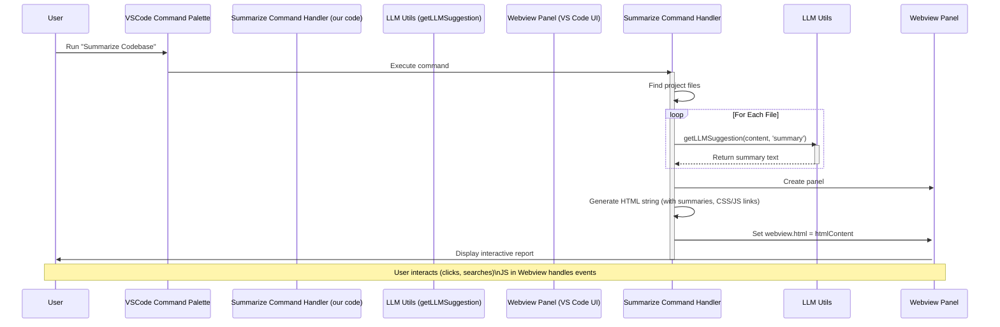

# Chapter 6: Codebase Summarization & Webview UI

Hello again! In the previous chapter, [Chapter 5: LLM Communication](05_llm_communication_.md), we learned how our extension talks to the Large Language Model (LLM) using a handy messenger function (`getLLMSuggestion`) to get AI-powered answers and suggestions.

Now, let's see how we can use that communication capability for a bigger task: understanding an entire project! Imagine you're joining a new team or looking at a large codebase for the first time. It can be overwhelming to figure out what all the different files do. Wouldn't it be nice to have an assistant who could read through the code and give you a quick summary of each part?

## What's the Big Idea? An Automated Project Tour Guide

That's exactly what the **Codebase Summarization** feature does! It acts like an automated research assistant built right into VS Code. When you trigger it (using a command, which we learned about in [Chapter 4: Command Handling](04_command_handling_.md)), it will:

1.  **Scan** your project directory to find relevant code files.
2.  **Read** the content of each file.
3.  **Ask the LLM** (using the tools from Chapter 5) to create a short summary for each file.
4.  **Compile** all these summaries into a neat, interactive report.
5.  **Display** this report inside a special custom panel within VS Code, called a **Webview**.

Think of this Webview panel like a mini web page living inside your editor. It's not just plain text; it can have headings, lists, buttons, search bars, and even collapsible sections, making it easy to navigate and understand the structure of your project at a glance.

**Goal:** To provide a high-level, interactive overview of your project's structure and purpose, generated automatically by an LLM and presented in a user-friendly interface within VS Code.

## Key Concepts

1.  **Codebase Scan (`vscode.workspace.findFiles`):** A way for our extension to search for files within your project based on patterns (like finding all `.js` or `.py` files, while ignoring folders like `node_modules`).
2.  **LLM Summarization:** Using the `getLLMSuggestion` function (from Chapter 5) with a specific `type` like `'summary'` to instruct the LLM to provide a concise overview of the code content we send it.
3.  **Webview Panel (`vscode.window.createWebviewPanel`):** A special VS Code API feature that allows our extension to create a new panel (like an editor tab) that displays custom HTML content. It's like embedding a web browser page directly into VS Code.
4.  **Webview HTML Content:** We generate standard HTML, CSS, and JavaScript code *as a string* within our extension. This string defines the structure, style, and behavior of the report displayed in the Webview panel.
5.  **Local Resources (`asWebviewUri`):** For security, Webviews can't directly access files on your computer. VS Code provides a special method (`panel.webview.asWebviewUri`) to create safe URIs for local files (like CSS stylesheets or JavaScript files) that the Webview is allowed to load.
6.  **Interactivity (JavaScript in Webview):** We can include JavaScript within our generated HTML. This script runs inside the Webview panel and can handle things like making sections collapsible or filtering the summaries based on user input in a search bar.

## How It Works: From Command to Interactive Report

Let's trace the steps when you trigger the "Summarize Codebase" command:

1.  **Command Trigger:** You run the `vscodellm.summarizeCodebase` command (e.g., from the Command Palette).
2.  **Command Handler Runs:** The code associated with this command in `src/commands/summarizeCodebase.ts` starts executing.
3.  **Find Files:** The handler uses `vscode.workspace.findFiles` to get a list of all relevant source code files in your project workspace.
4.  **Loop and Summarize:** The code iterates through each file found:
    *   Reads the file's content.
    *   Calls `getLLMSuggestion(fileContent, 'summary')` to ask the LLM for a summary.
    *   Stores the file's name and the returned summary.
5.  **Create Webview Panel:** Once all summaries are collected (or while they are being collected), the handler calls `vscode.window.createWebviewPanel` to create a new, blank panel ready to display our report.
6.  **Generate HTML:** The handler constructs a large HTML string. This string includes:
    *   Basic HTML structure (`<html>`, `<head>`, `<body>`).
    *   A link to a CSS file for styling (using `asWebviewUri`).
    *   A title, maybe a search bar.
    *   A section for each file, displaying its name, maybe an icon, the LLM's summary, and perhaps the file path. These sections are often designed as "cards".
    *   A link to a JavaScript file for interactivity (using `asWebviewUri`).
7.  **Set Webview Content:** The generated HTML string is assigned to `panel.webview.html`.
8.  **Report Displayed:** VS Code renders the HTML inside the Webview panel, showing you the interactive codebase summary report. You can now scroll through it, search, and expand/collapse file summaries.

## Walking Through the Code

Let's look at simplified snippets from the command handler and the webview's resources.

### Summarizing the Code (`src/commands/summarizeCodebase.ts`)

This is the command handler that orchestrates the process.

```typescript
// src/commands/summarizeCodebase.ts
import * as vscode from 'vscode';
import { getLLMSuggestion } from '../utils/llmUtils'; // Our LLM messenger
import { getFileIcon } from '../utils/webviewUtils'; // Helper for icons

// This function registers the command (called from extension.ts)
export function registerSummarizeCodebaseCommand(context: vscode.ExtensionContext) {
	// Register the command itself (see Chapter 4)
	let disposable = vscode.commands.registerCommand('vscodellm.summarizeCodebase', async () => {
		vscode.window.showInformationMessage('Summarizing codebase...');

		// 1. Find relevant files (e.g., JS, TS, Python, Markdown)
		const files = await vscode.workspace.findFiles('**/*.{js,ts,md,py}', '**/node_modules/**');
		const summaries = []; // Array to hold {fileName, summary} objects

		// 2. Loop through each file and get its summary
		for (const file of files) {
			const fileData = await vscode.workspace.fs.readFile(file);
			const content = Buffer.from(fileData).toString('utf8');
			// Ask the LLM for a summary (see Chapter 5)
			const summary = (await getLLMSuggestion(content, 'summary')) ?? 'No summary available.';
			summaries.push({ fileName: file.fsPath, summary });
		}

		// 3. Create the Webview panel
		const panel = vscode.window.createWebviewPanel(
			'codebaseSummary', // Internal ID for the panel type
			'Codebase Summary', // Title shown in the panel's tab
			vscode.ViewColumn.One, // Show in the main editor area
			{ enableScripts: true } // IMPORTANT: Allow JavaScript to run
		);

		// 4. Generate the HTML content for the Webview
		// (Simplified - actual code uses helper functions and more structure)
		const htmlContent = `
			<html>
			<head>
				<title>Codebase Summary</title>
				<!-- Link CSS/JS using asWebviewUri (not shown here for brevity) -->
			</head>
			<body>
				<h1>Codebase Insights (${summaries.length} files)</h1>
				<input type="text" placeholder="Search files..." onkeyup="handleSearch(event)">
				<div class="file-grid">
				${summaries.map(({ fileName, summary }) => `
					<div class="file-card">
						<div class="file-header">
							${getFileIcon(fileName)} ${fileName.split(/[\\\\/]/).pop()}
						</div>
						<div class="summary-content" style="display:none;">
							${summary} <!-- Assume summary is plain text or simple HTML -->
						</div>
					</div>
				`).join('')}
				</div>
				<!-- Include script.js -->
			</body>
			</html>`;

		// 5. Set the panel's HTML
		panel.webview.html = htmlContent;
	});

	context.subscriptions.push(disposable); // Clean up command registration
}
```

**Explanation:**

1.  **`registerCommand`:** Sets up the `vscodellm.summarizeCodebase` command.
2.  **`findFiles`:** Searches the workspace for files matching the specified patterns (common code files) and excluding `node_modules`.
3.  **Loop:** Iterates through the found `files`.
    *   `readFile`: Reads the binary content of the file.
    *   `Buffer.from(...).toString('utf8')`: Converts the binary data to a text string.
    *   `getLLMSuggestion(content, 'summary')`: Calls our Chapter 5 function to get the summary from the LLM.
    *   `summaries.push(...)`: Stores the result.
4.  **`createWebviewPanel`:** Creates the panel where the report will be shown. `enableScripts: true` is crucial for interactivity.
5.  **HTML Generation:** Builds the HTML string.
    *   It iterates through the `summaries` array using `.map()`.
    *   For each summary, it creates a `div` (a "card") containing the file name (extracted using `split` and `pop`) and the summary text. The summary content `div` starts hidden (`style="display:none;"`).
    *   Helper functions like `getFileIcon` (from `webviewUtils.ts`) might be used to add visual cues.
    *   Placeholders for linking CSS/JS and the search input are included.
6.  **`panel.webview.html = htmlContent`:** This is the final step that actually displays our generated report in the VS Code panel.

### Adding Interactivity (`resources/media/script.js`)

This JavaScript file runs *inside* the Webview panel to make the report interactive.

```javascript
// resources/media/script.js (Simplified)

// Function to show/hide the summary content when clicking the header
function toggleCard(cardHeader) {
	const card = cardHeader.parentElement;
	const content = card.querySelector('.summary-content');
	const isExpanded = card.getAttribute('data-expanded') === 'true';

	content.style.display = isExpanded ? 'none' : 'block'; // Toggle display
	card.setAttribute('data-expanded', !isExpanded); // Update state
}

// Function to filter cards based on the search input
function handleSearch(event) {
	const query = event.target.value.toLowerCase(); // Get search term
	const cards = document.querySelectorAll('.file-card'); // Get all file cards

	cards.forEach(card => {
		const fileName = card.querySelector('.file-header').textContent.toLowerCase();
		// Show card if file name includes the query, hide otherwise
		card.style.display = fileName.includes(query) ? 'block' : 'none';
	});
}

// Add click listeners to file headers when the page loads
document.addEventListener('DOMContentLoaded', () => {
	document.querySelectorAll('.file-header').forEach(header => {
		header.addEventListener('click', () => toggleCard(header));
	});
});
```

**Explanation:**

1.  **`toggleCard`:** Finds the summary content within a card and toggles its `display` style between `block` (visible) and `none` (hidden) when the header is clicked. It also keeps track of the state using a `data-expanded` attribute.
2.  **`handleSearch`:** Gets the text typed into the search box, loops through all file cards, and hides (`display: 'none'`) any card whose filename doesn't match the search query.
3.  **`DOMContentLoaded`:** Ensures that the event listeners (like the click handler for `toggleCard`) are only added *after* the HTML page has fully loaded in the Webview.

## Visualizing the Flow

Here's how the main components interact:



## Conclusion: Your Project's Interactive Map

The Codebase Summarization feature is a fantastic example of combining multiple VS Code extension concepts: Commands provide the trigger, LLM Communication gets the insights, and Webviews present the information in a rich, custom, and interactive way.

By automatically generating summaries and displaying them in a searchable, collapsible format, this feature acts like an instant tour guide, helping you quickly grasp the structure and purpose of any codebase. It showcases how extensions can create custom UI elements within VS Code to present complex information effectively.

While this feature gets context by reading file content directly, sometimes AI assistants need more specific, structured data, especially when dealing with databases. How can our extension efficiently fetch and use database schema information? Let's explore that next!

**Next Chapter:** [Chapter 7: Database Context Retrieval](07_database_context_retrieval_.md)

---

Generated by [AI Codebase Knowledge Builder]