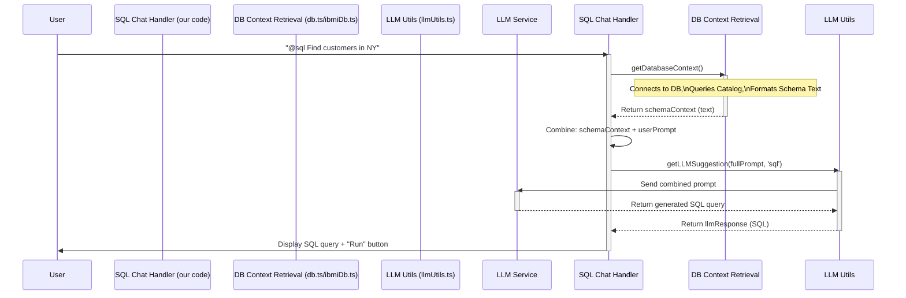

# Chapter 7: Database Context Retrieval

Welcome to the final chapter in our core concepts tour of `vscodellm`! In [Chapter 6: Codebase Summarization & Webview UI](06_codebase_summarization___webview_ui.md), we saw how the extension can analyze your project files and present a summary in a custom interface. That feature read the *content* of your files.

But what if the AI needs information that *isn't* directly in your code files? Imagine you're using the `@sql` chat assistant from [Chapter 3: Chat Interaction Participants](03_chat_interaction_participants_.md). You might ask it, "Write a query to find all customers in the 'New York' city." How does the AI know if you have a `customers` table, or if the city information is stored in a column named `city` or `customer_city`?

It needs to understand the **structure** of your database. That's where **Database Context Retrieval** comes in.

## What's the Big Idea? Your AI's Database Specialist

Think of this component like a **database specialist** who works for the AI. When the AI needs to write a query or understand how data is organized, it doesn't guess. It asks this specialist.

The specialist's job is to:

1.  **Connect** to the relevant database (like MySQL or an IBM i system).
2.  **Query** the database's own "phone book" – its internal catalog or "information schema" – which lists all the tables and their columns.
3.  **Organize** this information into a simple text format.
4.  **Hand** this text description (the "schema") back to the AI assistant.

Now, armed with this blueprint of the database structure, the AI (specifically the LLM, using the tools from [Chapter 5: LLM Communication](05_llm_communication_.md)) can generate much more accurate and relevant SQL code.

**Goal:** To automatically fetch the structure (schema) of connected databases and provide it as text context to the LLM, enabling better database-related code generation.

## Key Concepts

1.  **Database Schema:** The blueprint or structure of a database. It defines:
    *   **Tables:** Collections of related data (like `customers`, `orders`).
    *   **Columns:** Specific pieces of information within a table (like `customer_id`, `name`, `city`).
    *   **Data Types:** The kind of data each column holds (like `INT` for numbers, `VARCHAR` for text, `DATE` for dates).
2.  **Database Catalog / Information Schema:** A special set of tables *within* the database that describes the database itself. By querying these tables, we can find out what user tables and columns exist. (e.g., `INFORMATION_SCHEMA` in MySQL, `QSYS2` library in IBM i).
3.  **Database Connection:** The process of establishing communication with the database server (requires details like address, username, password). `vscodellm` uses libraries like `mysql2` for MySQL or relies on the `Code for IBM i` extension's connection for IBM i.
4.  **Schema Formatting:** The process of taking the raw list of tables and columns and turning it into a human-readable (and LLM-readable) text format, often listing each table followed by its columns and data types.

## How It Works: Peeking Inside the Database

The process is quite straightforward:

1.  **Request:** A feature, like the `@sql` chat participant, needs the database schema.
2.  **Call the Helper:** It calls a specific function, like `getDatabaseContext()`, provided by this module (`src/utils/db.ts` or `src/utils/ibmiDb.ts`).
3.  **Connect:** The helper function establishes a connection to the target database using stored or configured credentials.
4.  **Query Catalog:** It runs a specific SQL query against the database's catalog tables to retrieve the names of tables, columns, and their data types for the current database/schema.
5.  **Process Results:** It loops through the query results.
6.  **Format Text:** It builds a text string that clearly lists each table and its columns/types.
7.  **Return Context:** The formatted text string is returned to the feature that requested it.

## Walking Through the Code

Let's look at how this works for a MySQL database first.

### MySQL Schema Retrieval (`src/utils/db.ts`)

This file contains the logic for connecting to MySQL and fetching its schema.

```typescript
// src/utils/db.ts (Simplified)
import mysql from 'mysql2/promise'; // Library to talk to MySQL
import { RowDataPacket } from 'mysql2'; // Type definition for query results

// Type for the rows returned by our schema query
interface SchemaRow extends RowDataPacket {
	TABLE_NAME: string;
	COLUMN_NAME: string;
	DATA_TYPE: string;
}

// Function to get the schema as text
export async function getDatabaseContext(includeHeader = true): Promise<string> {
	// (Connection details would typically come from configuration)
	const connection = await mysql.createConnection({ /* connection details */ });
	const dbName = connection.config.database; // Get the database name

	// Query the special INFORMATION_SCHEMA table
	const [rows] = await connection.query<SchemaRow[]>(
		`SELECT TABLE_NAME, COLUMN_NAME, DATA_TYPE
         FROM INFORMATION_SCHEMA.COLUMNS
         WHERE TABLE_SCHEMA = ?  -- Only for the current database
         ORDER BY TABLE_NAME, ORDINAL_POSITION;`,
		[dbName], // Pass the database name as a parameter
	);

	await connection.end(); // Close the connection

	// --- Format the results into text ---
	const schemaMap: { [tableName: string]: { columnName: string; dataType: string }[] } = {};
	// Group columns by table name
	for (const row of rows) {
		if (!schemaMap[row.TABLE_NAME]) schemaMap[row.TABLE_NAME] = [];
		schemaMap[row.TABLE_NAME].push({ columnName: row.COLUMN_NAME, dataType: row.DATA_TYPE });
	}

	// Build the final text description
	let schemaDescription = '';
	for (const [tableName, columns] of Object.entries(schemaMap)) {
		schemaDescription += `Table: ${tableName}\n`;
		columns.forEach(col => {
			schemaDescription += `  - ${col.columnName} (${col.dataType})\n`;
		});
		schemaDescription += '\n';
	}

	// Optionally add a header
	return includeHeader
		? `Here are the tables and columns in the '${dbName}' database:\n\n${schemaDescription}`
		: schemaDescription;
}
```

**Explanation:**

1.  **Import:** Imports the necessary MySQL library.
2.  **`getDatabaseContext`:** The main function that will be called by other parts of the extension.
3.  **Connect:** Establishes a connection to the MySQL database (details omitted for brevity).
4.  **Query:** Executes an SQL query against `INFORMATION_SCHEMA.COLUMNS`. This special table holds information about all columns in all tables. We filter by `TABLE_SCHEMA` to get info only for the currently connected database.
5.  **Close Connection:** `connection.end()` releases the database connection.
6.  **Format (`schemaMap`)**: The code iterates through the results (`rows`) and organizes them into a `schemaMap`, where each key is a table name, and the value is a list of its columns.
7.  **Build String:** It then loops through the `schemaMap` to build the final `schemaDescription` text, formatting it nicely with table names and indented column lists.
8.  **Return:** Returns the formatted string, optionally adding a header message.

### IBM i Schema Retrieval (`src/utils/ibmiDb.ts`)

Fetching schema from IBM i works conceptually the same way, but it uses different connection methods (relying on the `Code for IBM i` VS Code extension) and queries different system catalog tables (`QSYS2.SYSCOLUMNS`, `QSYS2.SYSTABLES`).

```typescript
// src/utils/ibmiDb.ts (Conceptual Snippet)
import { loadBase, getInstance } from './ibmiConnection'; // IBM i connection helpers

// Helper to format IBM i results (similar logic to MySQL version)
function formatSchemaDescription(/*...rows...*/) { /* ... */ }

// Function to get IBM i schema
export async function getDatabaseContext() {
    const instance = getInstance(); // Get connection instance from Code for IBM i ext
	if (!instance) { /* Handle no connection */ return; }

    // SQL query for IBM i system catalog tables
	const sql = `
      SELECT c.TABLE_NAME, c.COLUMN_NAME, c.DATA_TYPE
      FROM QSYS2.SYSCOLUMNS c
      JOIN QSYS2.SYSTABLES t ON c.TABLE_NAME = t.TABLE_NAME AND c.TABLE_SCHEMA = t.TABLE_SCHEMA
      WHERE c.TABLE_SCHEMA = 'YOUR_LIBRARY' -- Specify the library (schema)
      -- Other filters...
      ORDER BY c.TABLE_NAME, c.ORDINAL_POSITION`;

	try {
		// Run the SQL using the IBM i connection
		const result = await instance.getConnection().runSQL(sql);
		// Process and format 'result' using formatSchemaDescription...
        const schemaText = formatSchemaDescription(result, true, 'YOUR_LIBRARY');
		return schemaText;
	} catch (error) { /* Handle errors */ }
}
```

**Explanation:**

*   It uses helper functions (`getInstance`) to interact with the `Code for IBM i` extension's active connection.
*   The SQL query targets IBM i specific catalog tables (`QSYS2.SYSCOLUMNS`, `QSYS2.SYSTABLES`).
*   It uses `instance.getConnection().runSQL()` to execute the query.
*   The formatting logic (`formatSchemaDescription`) is similar to the MySQL version, converting the query results into a structured text string.

## Putting it All Together: The `@sql` Chat Participant

How is this retrieved context actually used? Let's revisit the `@sql` chat participant from [Chapter 3](03_chat_interaction_participants_.md).

```typescript
// src/participants/chatParticipant.ts (Snippet from registerSqlChatParticipant)

import { getDatabaseContext } from '../utils/db'; // Import the MySQL helper
// OR: import { getDatabaseContext } from '../utils/ibmiDb'; // If targeting IBM i

// ... inside the sqlhandler async function ...

const sqlhandler: vscode.ChatRequestHandler = async (request, chatContext, response, token) => {
	const userPrompt = request.prompt; // e.g., "Find customers in New York"

    // --- 1. Fetch the Database Schema ---
	// (Determine which function to call based on configuration or context)
	const schemaContext = await getDatabaseContext(); // Calls the helper!

    // --- 2. Combine Schema with User Prompt ---
    // Prepend the schema context to the user's actual question
	const fullPrompt = `${schemaContext}\n\nUser question: ${userPrompt}`;

    // --- 3. Send to LLM ---
    // Use the combined prompt to get a better SQL query
	const llmResponse = await getLLMSuggestion(fullPrompt, 'sql');

	// --- 4. Display Response & Buttons ---
	if (llmResponse) {
		response.markdown(llmResponse);
        // Add "Run Query" button etc.
	} else {
        response.markdown('Could not get a response.');
    }
	// ... rest of the handler ...
};
```

**Explanation:**

1.  **Fetch Context:** Before even talking to the LLM, the handler calls `getDatabaseContext()`. This function connects to the database, queries the catalog, formats the schema, and returns it as the `schemaContext` string.
2.  **Combine Prompt:** The crucial step! It creates a `fullPrompt` by putting the `schemaContext` *before* the user's original question (`userPrompt`).
3.  **Send to LLM:** It sends this combined `fullPrompt` to the LLM via `getLLMSuggestion`. Now, the LLM receives not just the user's question but also the detailed blueprint of the database tables and columns, allowing it to generate a much more accurate SQL query.

## Visualizing the Flow (@sql Participant)

Here's how the `@sql` participant uses the Database Context Retrieval module:



## Conclusion: Empowering the AI with Knowledge

The **Database Context Retrieval** component is a vital bridge between the abstract world of the LLM and the concrete structure of your databases. By automatically fetching and formatting the database schema, it provides the essential context the LLM needs to perform database-related tasks effectively, particularly generating accurate SQL queries. It's a specialized tool that significantly enhances the capabilities of features like the `@sql` chat participant.

This concludes our tour through the core concepts of the `vscodellm` extension! We've journeyed from how the extension starts ([Chapter 1](01_extension_lifecycle___registration_.md)), through providing code help ([Chapter 2](02_inline_code_completion_provider_.md)), chatting with AI experts ([Chapter 3](03_chat_interaction_participants_.md)), triggering actions ([Chapter 4](04_command_handling_.md)), talking to the AI ([Chapter 5](05_llm_communication_.md)), summarizing codebases ([Chapter 6](06_codebase_summarization___webview_ui.md)), and finally, understanding database structures ([Chapter 7](07_database_context_retrieval_.md)).

We hope this gives you a solid foundation for understanding how `vscodellm` works and inspires you to explore its code further or even contribute! Happy coding!

---

Generated by [AI Codebase Knowledge Builder]