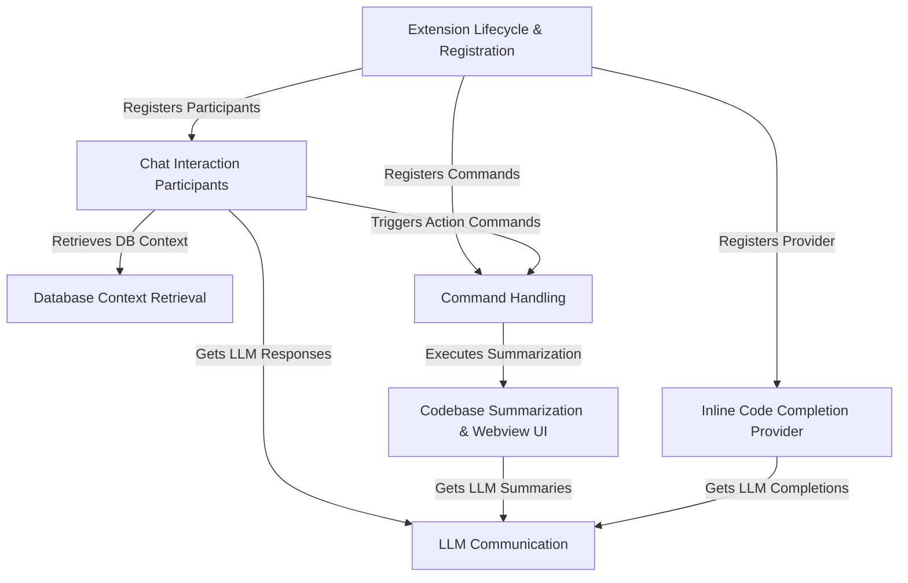

# Tutorial: vscodellm

This VS Code extension acts as an *AI coding assistant*.
It uses a **Large Language Model** (LLM) to help you with tasks like generating *code suggestions* while you type, **summarizing** your entire project into an interactive report, and answering your coding questions within a **chat panel**. It can even connect to databases to provide context-aware assistance for things like writing *SQL queries*.

## Chapters

1. [Extension Lifecycle & Registration
](01_extension_lifecycle___registration_.md)
2. [Inline Code Completion Provider
](02_inline_code_completion_provider_.md)
3. [Chat Interaction Participants
](03_chat_interaction_participants_.md)
4. [Command Handling
](04_command_handling_.md)
5. [LLM Communication
](05_llm_communication_.md)
6. [Codebase Summarization & Webview UI
](06_codebase_summarization___webview_ui_.md)
7. [Database Context Retrieval
](07_database_context_retrieval_.md)

---

Generated by [AI Codebase Knowledge Builder]